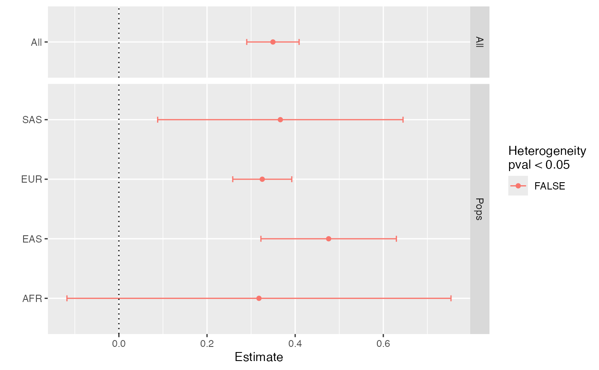
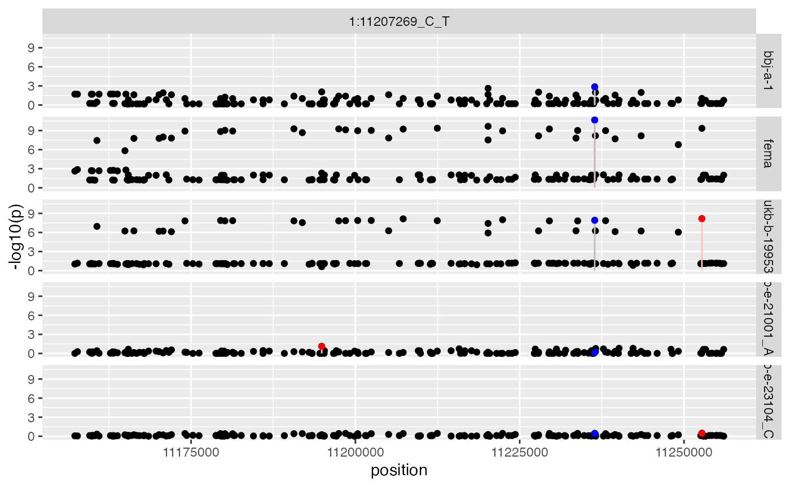
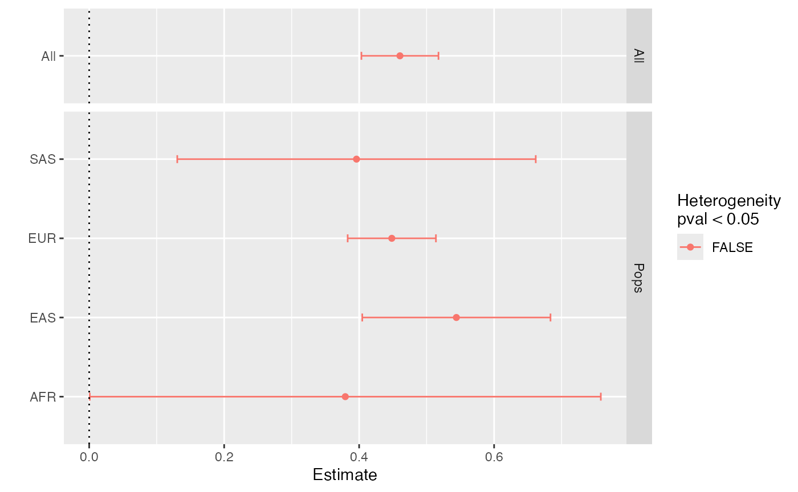
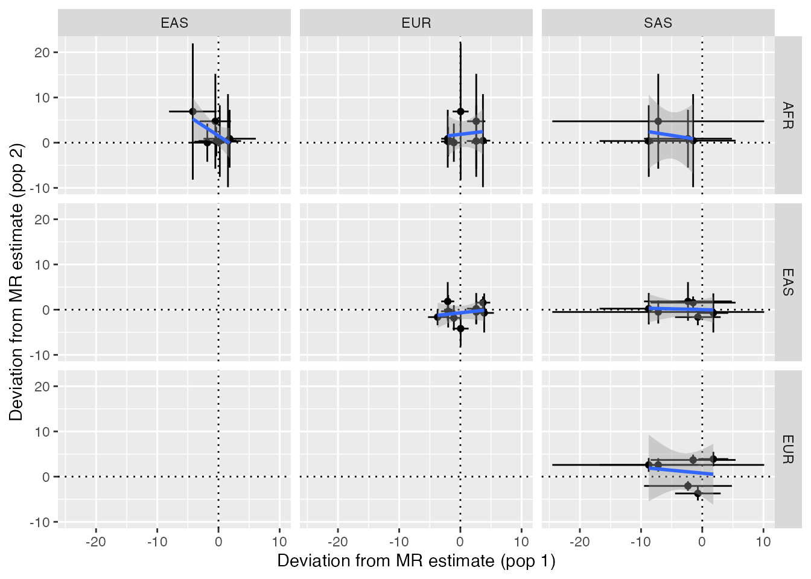
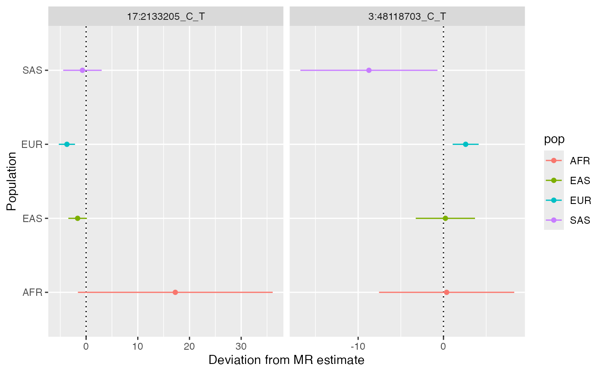
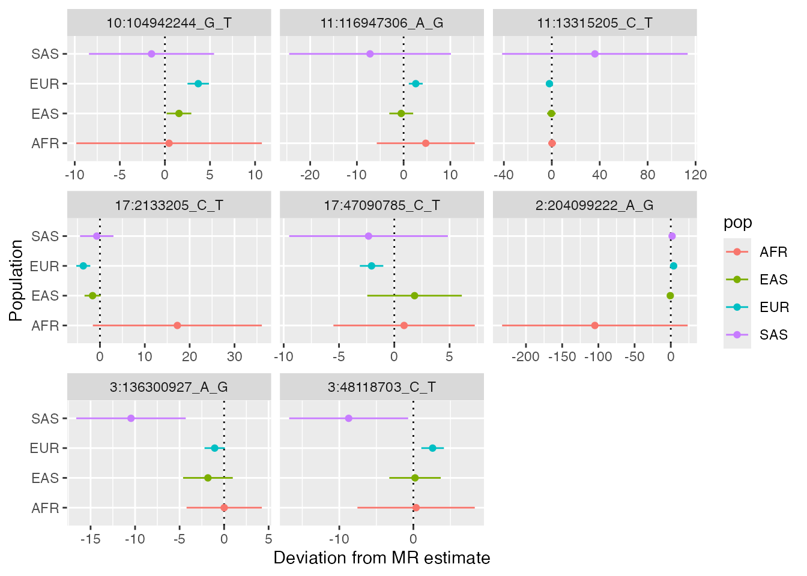
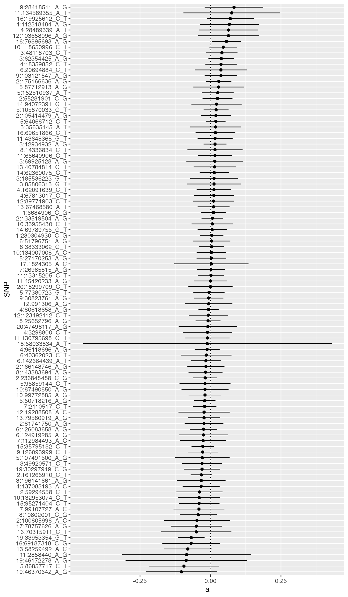
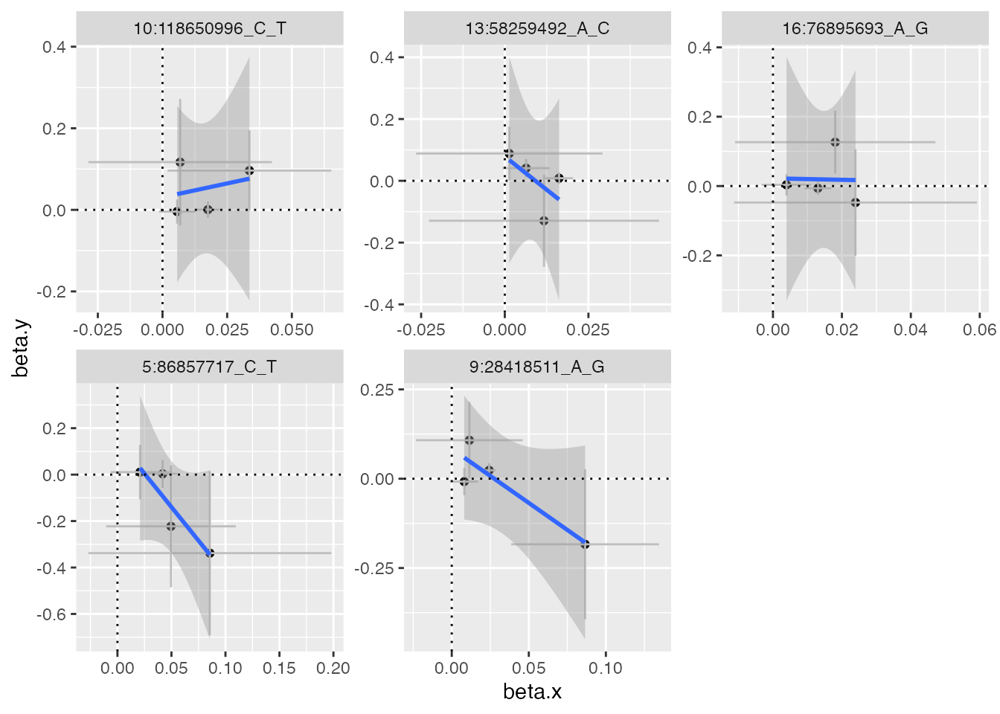

# Tutorial

\
[`library`](https://rdrr.io/r/base/library.html)`(`[`CAMeRa`](https://github.com/MRCIEU/CAMERA)`)`

## Introduction

This software attempts to bring together various tools to improve
cross-ancestry Mendelian randomisation. It will use an example of
performing analysis of BMI on coronary heart disease across four major
ancestral groups.

Overview:

- Initialise data
- Check phenotype scales across ancestries
- Extract instruments
- Evaluate instrument heterogeneity across populations
- Extract outcome data
- Harmonise exposure and outcome data
- Perform analysis using raw instruments
- Perform regional scan to obtain LD agnostic instruments
- Re-perform analysis using regional instruments
- Evaluate similarity of pleiotropy across ancestry
- Evaluate similarity of instrument-exposure associations
- Use cross-population instrument-exposure heterogeneity in MR GxE
  framework to estimate pleiotropy distributions
- Saving and loading data

## Initialise data

CAMeRa begins by choosing an exposure and outcome hypothesis that can be
tested in multi-ancestral populations. Here, we will be estimating the
causal effect of body mass index (BMI) on coronary heart disease (CHD)
in European (EUR), East Asian (EAS), African (AFR) and South Asian (SAS)
ancestries.

Summary statistics data can be extracted from the IEU GWAS database
using the [TwoSampleMR](https://mrcieu.github.io/TwoSampleMR/) package.
A list of available traits can be obtained using:

\
`traits`` ``<-`` ``TwoSampleMR``::`[`available_outcomes`](https://mrcieu.github.io/TwoSampleMR/reference/available_outcomes.html)`(``)`

You can also browse the available traits here:
<https://gwas.mrcieu.ac.uk/>. Also see other vignettes on this site
about how you can use local summary statistics instead.

Querying the OpenGWAS API requires an access token, see the [ieugwasr
guide](https://mrcieu.github.io/ieugwasr/articles/guide.html#authentication)
for how to obtain and set one up. The examples in this vignette make
many API queries and so may use up a large part of your
[allowance](https://api.opengwas.io/api/#allowance). To keep this
vignette fast to build, the code chunks that query the API are not run
here, instead the results are loaded from an example object that ships
with the package.

Once you obtain the study IDs for the exposure and the outcome, open R6
class environment to run CAMERA. The minimum information required for
CAMERA is the following:

- Summary statistics for the exposure and the outcome
- Population information
- Plink (version 1.90)
- LD reference data

Plink (version 1.90) and LD reference data are required to identify
instruments that can be used for both populations. LD reference data can
be accessed from: <http://fileserve.mrcieu.ac.uk/ld/1kg.v3.tgz>.

\
`bfile_dir`` ``<-`` ``"/path/to/ld_files"`\
`x`` ``<-`` `[`CAMERA`](https://mrcieu.github.io/CAMERA/reference/CAMERA.md)`$``new``(`\
`  exposure_ids``=`[`c`](https://rdrr.io/r/base/c.html)`(`\
`    ``"ukb-e-23104_CSA"``, `\
`    ``"ukb-e-21001_AFR"``, `\
`    ``"ukb-b-19953"``, `\
`    ``"bbj-a-1"`\
`  ``)``, `\
`  outcome_ids``=`[`c`](https://rdrr.io/r/base/c.html)`(`\
`    ``"ukb-e-411_CSA"``, `\
`    ``"ukb-e-411_AFR"``, `\
`    ``"ieu-a-7"``, `\
`    ``"bbj-a-109"`\
`  ``)``, `\
`  pops ``=`` `[`c`](https://rdrr.io/r/base/c.html)`(``"SAS"``, ``"AFR"``, ``"EUR"``, ``"EAS"``)``,`\
`  bfiles``=`[`file.path`](https://rdrr.io/r/base/file.path.html)`(``bfile_dir``, `[`c`](https://rdrr.io/r/base/c.html)`(``"SAS"``, ``"AFR"``, ``"EUR"``, ``"EAS"``)``)``,`\
`  plink ``=`` ``genetics.binaRies``::`[`get_plink_binary`](https://rdrr.io/pkg/genetics.binaRies/man/get_plink_binary.html)`(``)``,        `\
`  radius``=``50000``, `\
`  clump_pop``=``"EUR"`\
`)`\
`x`

## Check phenotype scales across ancestries

Make sure that the exposures/outcomes are matched across the
populations. The different populations should have the same
exposure-outcome pair, with exposure and outcome traits measured in the
same way and with the same units. Also, instrument-trait associations
should be consistent between the populations (e.g. how similar SNP-BMI
association in EUR to SNP-BMI association in EAS). You can check this as
follows:

\
`x``$``check_phenotypes``(``ids``=``x``$``exposure_ids``)`\
`x``$``check_phenotypes``(``ids``=``x``$``outcome_ids``)`

## Extract instruments

We can now perform the analysis, which will do the following:

1.  Extract instruments for the exposures
2.  Check the validity of the instruments across the populations
    (Standardise/scale the data if necessary)
3.  Extract new instruments based on LD information and fine-mapping
4.  Extract instruments for the outcomes
5.  Harmonise the exposure data and the outcome data
6.  Perform MR

Note see the
[`?CAMERA`](https://mrcieu.github.io/CAMERA/reference/CAMERA.md) for
options on the parameters for this analysis.

The following function identifies SNPs that have strong associations
with the exposure in each population. This is the same method as
instrument extraction for multivariable MR.

\
`x``$``extract_instruments``(``)`

A data frame of the extracted instruments is stored in
`x$instrument_raw`

\
[`str`](https://rdrr.io/r/utils/str.html)`(``x``$``instrument_raw``)`\
`#> 'data.frame':    1495 obs. of  14 variables:`\
`#>  $ rsid      : chr  "1:2723214_A_C" "1:6657424_A_C" "1:11207269_C_T" "1:19934900_A_G" ...`\
`#>  $ chr       : chr  "1" "1" "1" "1" ...`\
`#>  $ position  : int  2723214 6657424 11207269 19934900 23313353 33784146 39564930 47678458 49996959 66434743 ...`\
`#>  $ id        : chr  "ukb-e-23104_CSA" "ukb-e-23104_CSA" "ukb-e-23104_CSA" "ukb-e-23104_CSA" ...`\
`#>  $ beta      : num  -0.0266 -0.0235 0.0171 -0.0148 -0.0169 ...`\
`#>  $ se        : num  0.0154 0.0154 0.0192 0.0169 0.0146 ...`\
`#>  $ p         : num  0.0841 0.1262 0.3728 0.3823 0.2496 ...`\
`#>  $ ea        : chr  "A" "A" "C" "A" ...`\
`#>  $ nea       : chr  "C" "C" "T" "G" ...`\
`#>  $ eaf       : num  0.67 0.676 0.834 0.766 0.422 ...`\
`#>  $ units     : chr  "NA" "NA" "NA" "NA" ...`\
`#>  $ samplesize: num  8658 8658 8658 8658 8658 ...`\
`#>  $ method    : chr  "raw" "raw" "raw" "raw" ...`\
`#>  $ rsido     : chr  "rs4648450" "rs3866805" "rs2791643" "rs61740466" ...`

## Evaluate instrument heterogeneity across populations

It is important to ensure that the instruments for the exposure are
valid across the populations. Once instruments for the exposure trait
are identified for each population, we can assess specificity of the
instruments. Each of the following functions estimates heterogeneity of
the instruments between and calculates fraction of the instruments
(obtained from the Step 1) that are replicated between the populations.

\
`x``$``instrument_heterogeneity``(``)`\
`#> ``# A tibble: 6 × 9`\
`#>   Reference  Replication  nsnp agreement     se      pval    I2      Q    Q_pval`\
`#>   ``<chr>``      ``<chr>``       ``<int>``     ``<dbl>``  ``<dbl>``     ``<dbl>`` ``<dbl>``  ``<dbl>``     ``<dbl>`\
`#> ``1`` ukb-b-199… ukb-e-2310…   367     0.603 0.050``5`` 7.52``e``- 33`` 0.123  418.  3.06``e``-  2`\
`#> ``2`` ukb-b-199… ukb-e-2100…   367     0.417 0.070``3`` 3.14``e``-  9`` 0.143  428.  1.36``e``-  2`\
`#> ``3`` ukb-b-199… bbj-a-1       367     0.580 0.021``9`` 7.07``e``-155`` 0.658 ``1``074.  8.47``e``- 71`\
`#> ``4`` bbj-a-1    ukb-e-2310…    45     0.642 0.111  7.04``e``-  9`` 0.415   77.0 1.54``e``-  3`\
`#> ``5`` bbj-a-1    ukb-e-2100…    45     0.415 0.152  6.49``e``-  3`` 0.426   78.4 1.10``e``-  3`\
`#> ``6`` bbj-a-1    ukb-b-19953    45     0.860 0.051``2`` 2.29``e``- 63`` 0.947  842.  4.23``e``-148`

\
`x``$``estimate_instrument_specificity``(``instrument``=``x``$``instrument_raw``)`\
`#> Checking ukb-e-23104_CSA against ukb-e-21001_AFR`\
`#> Checking ukb-e-23104_CSA against ukb-b-19953`\
`#> Checking ukb-e-23104_CSA against bbj-a-1`\
`#> Checking ukb-e-21001_AFR against ukb-e-23104_CSA`\
`#> Checking ukb-e-21001_AFR against ukb-b-19953`\
`#> Checking ukb-e-21001_AFR against bbj-a-1`\
`#> Checking ukb-b-19953 against ukb-e-23104_CSA`\
`#> Checking ukb-b-19953 against ukb-e-21001_AFR`\
`#> Checking ukb-b-19953 against bbj-a-1`\
`#> Checking bbj-a-1 against ukb-e-23104_CSA`\
`#> Checking bbj-a-1 against ukb-e-21001_AFR`\
`#> Checking bbj-a-1 against ukb-b-19953`\
`#>          discovery     replication nsnp  metric    datum       value`\
`#> 1  ukb-e-21001_AFR ukb-e-23104_CSA    1 P-value Expected   0.9987959`\
`#> 2  ukb-e-21001_AFR ukb-e-23104_CSA    1 P-value Observed   1.0000000`\
`#> 3  ukb-e-21001_AFR ukb-e-23104_CSA    1    Sign Expected   0.9999995`\
`#> 4  ukb-e-21001_AFR ukb-e-23104_CSA    1    Sign Observed   1.0000000`\
`#> 5  ukb-e-21001_AFR     ukb-b-19953    1 P-value Expected   1.0000000`\
`#> 6  ukb-e-21001_AFR     ukb-b-19953    1 P-value Observed   1.0000000`\
`#> 7  ukb-e-21001_AFR     ukb-b-19953    1    Sign Expected   0.9999995`\
`#> 8  ukb-e-21001_AFR     ukb-b-19953    1    Sign Observed   1.0000000`\
`#> 9  ukb-e-21001_AFR         bbj-a-1    1 P-value Expected   1.0000000`\
`#> 10 ukb-e-21001_AFR         bbj-a-1    1 P-value Observed   1.0000000`\
`#> 11 ukb-e-21001_AFR         bbj-a-1    1    Sign Expected   0.9999995`\
`#> 12 ukb-e-21001_AFR         bbj-a-1    1    Sign Observed   1.0000000`\
`#> 13     ukb-b-19953 ukb-e-23104_CSA  367 P-value Expected   1.7683672`\
`#> 14     ukb-b-19953 ukb-e-23104_CSA  367 P-value Observed   2.0000000`\
`#> 15     ukb-b-19953 ukb-e-23104_CSA  367    Sign Expected 306.2709020`\
`#> 16     ukb-b-19953 ukb-e-23104_CSA  367    Sign Observed 261.0000000`\
`#> 17     ukb-b-19953 ukb-e-21001_AFR  367 P-value Expected   0.4150693`\
`#> 18     ukb-b-19953 ukb-e-21001_AFR  367 P-value Observed   1.0000000`\
`#> 19     ukb-b-19953 ukb-e-21001_AFR  367    Sign Expected 277.0372286`\
`#> 20     ukb-b-19953 ukb-e-21001_AFR  367    Sign Observed 217.0000000`\
`#> 21     ukb-b-19953         bbj-a-1  367 P-value Expected 125.8672314`\
`#> 22     ukb-b-19953         bbj-a-1  367 P-value Observed  42.0000000`\
`#> 23     ukb-b-19953         bbj-a-1  367    Sign Expected 362.4660856`\
`#> 24     ukb-b-19953         bbj-a-1  367    Sign Observed 321.0000000`\
`#> 25         bbj-a-1 ukb-e-23104_CSA   45 P-value Expected   1.4396361`\
`#> 26         bbj-a-1 ukb-e-23104_CSA   45 P-value Observed   2.0000000`\
`#> 27         bbj-a-1 ukb-e-23104_CSA   45    Sign Expected  41.3635330`\
`#> 28         bbj-a-1 ukb-e-23104_CSA   45    Sign Observed  35.0000000`\
`#> 29         bbj-a-1 ukb-e-21001_AFR   45 P-value Expected   0.2681076`\
`#> 30         bbj-a-1 ukb-e-21001_AFR   45 P-value Observed   1.0000000`\
`#> 31         bbj-a-1 ukb-e-21001_AFR   45    Sign Expected  38.0010867`\
`#> 32         bbj-a-1 ukb-e-21001_AFR   45    Sign Observed  27.0000000`\
`#> 33         bbj-a-1     ukb-b-19953   45 P-value Expected  44.3523980`\
`#> 34         bbj-a-1     ukb-b-19953   45 P-value Observed  40.0000000`\
`#> 35         bbj-a-1     ukb-b-19953   45    Sign Expected  44.9998612`\
`#> 36         bbj-a-1     ukb-b-19953   45    Sign Observed  45.0000000`\
`#>           pdiff`\
`#> 1  1.000000e+00`\
`#> 2  1.000000e+00`\
`#> 3  1.000000e+00`\
`#> 4  1.000000e+00`\
`#> 5  1.000000e+00`\
`#> 6  1.000000e+00`\
`#> 7  1.000000e+00`\
`#> 8  1.000000e+00`\
`#> 9  1.000000e+00`\
`#> 10 1.000000e+00`\
`#> 11 1.000000e+00`\
`#> 12 1.000000e+00`\
`#> 13 6.981287e-01`\
`#> 14 6.981287e-01`\
`#> 15 3.629548e-09`\
`#> 16 3.629548e-09`\
`#> 17 3.398606e-01`\
`#> 18 3.398606e-01`\
`#> 19 5.755367e-12`\
`#> 20 5.755367e-12`\
`#> 21 1.064999e-23`\
`#> 22 1.064999e-23`\
`#> 23 3.048804e-31`\
`#> 24 3.048804e-31`\
`#> 25 6.557071e-01`\
`#> 26 6.557071e-01`\
`#> 27 2.716399e-03`\
`#> 28 2.716399e-03`\
`#> 29 2.357876e-01`\
`#> 30 2.357876e-01`\
`#> 31 6.800783e-05`\
`#> 32 6.800783e-05`\
`#> 33 4.670267e-04`\
`#> 34 4.670267e-04`\
`#> 35 1.000000e+00`\
`#> 36 1.000000e+00`

## Extract outcome data

\
`x``$``make_outcome_data``(``)`

## Harmonise exposure and outcome data

\
`x``$``harmonise``(``)`\
`#> ``# A tibble: 4 × 4`\
`#>   pops  exposure_ids    outcome_ids   source  `\
`#>   ``<chr>`` ``<chr>``           ``<chr>``         ``<chr>``   `\
`#> ``1`` SAS   ukb-e-23104_CSA ukb-e-411_CSA OpenGWAS`\
`#> ``2`` AFR   ukb-e-21001_AFR ukb-e-411_AFR OpenGWAS`\
`#> ``3`` EUR   ukb-b-19953     ieu-a-7       OpenGWAS`\
`#> ``4`` EAS   bbj-a-1         bbj-a-109     OpenGWAS`\
`#> 'data.frame':    1495 obs. of  4 variables:`\
`#>  $ SNP : chr  "1:2723214_A_C" "1:6657424_A_C" "1:11207269_C_T" "1:19934900_A_G" ...`\
`#>  $ pops: chr  "SAS" "SAS" "SAS" "SAS" ...`\
`#>  $ beta: num  -0.0266 -0.0235 0.0171 -0.0148 -0.0169 ...`\
`#>  $ se  : num  0.0154 0.0154 0.0192 0.0169 0.0146 ...`\
`#> NULL`\
`#> 'data.frame':    2434 obs. of  4 variables:`\
`#>  $ SNP : chr  "1:11207269_C_T" "1:11207269_C_T" "1:11207269_C_T" "1:11207269_C_T" ...`\
`#>  $ pops: chr  "SAS" "AFR" "EUR" "EAS" ...`\
`#>  $ beta: num  -0.06663 -0.09457 -0.00328 0.0234 0.00391 ...`\
`#>  $ se  : num  0.0594 0.0809 0.0112 0.0319 0.0457 ...`\
`#> NULL`\
`#> 'data.frame':    1477 obs. of  6 variables:`\
`#>  $ SNP   : chr  "1:2723214_A_C" "1:6657424_A_C" "1:11207269_C_T" "1:19934900_A_G" ...`\
`#>  $ pops  : chr  "SAS" "SAS" "SAS" "SAS" ...`\
`#>  $ beta.x: num  -0.0266 -0.0235 0.0171 -0.0148 -0.0169 ...`\
`#>  $ se.x  : num  0.0154 0.0154 0.0192 0.0169 0.0146 ...`\
`#>  $ beta.y: num  -0.0152 -0.0295 -0.0666 0.0603 0.0465 ...`\
`#>  $ se.y  : num  0.048 0.0479 0.0594 0.0527 0.0456 ...`\
`#> NULL`

## Perform analysis using raw instruments

We will perform an inverse variance weighted fixed effects MR method
within population and across all populations. Heterogeneity estimates
will be generated to evaluate if each population has a distinct
association compared to others. The combined estimate across all
populations assumes that the effect is drawn from the same distribution
and if that assumption holds then then power is improved because of the
combined information.

\
`x``$``cross_estimate``(``)`\
`#> ``# A tibble: 5 × 8`\
`` #>   pops  Estimate `Std. Error` `t value` `Pr(>|t|)`     Qj Qjpval   Qdf ``\
`#>   ``<chr>``    ``<dbl>``        ``<dbl>``     ``<dbl>``      ``<dbl>``  ``<dbl>``  ``<dbl>`` ``<dbl>`\
`#> ``1`` All      0.350       0.030``3``     11.5    1.52``e``-29`` 3.14    0.371     3`\
`#> ``2`` AFR      0.318       0.222       1.43   1.53``e``- 1`` 0.020``3``  0.887     1`\
`#> ``3`` EAS      0.476       0.078``4``      6.07   1.62``e``- 9`` 2.60    0.107     1`\
`#> ``4`` EUR      0.325       0.034``2``      9.52   6.61``e``-21`` 0.503   0.478     1`\
`#> ``5`` SAS      0.366       0.142       2.58   9.98``e``- 3`` 0.014``1``  0.906     1`

Here we see a very consistent association across all ancestries. Note
that the `All` estimate is slightly more precisely estimated than any of
the others because it is combining similar estimates.

We can visualise the estimates:

\
`x``$``plot_cross_estimate``(``)`

## Perform regional scan to obtain LD agnostic instruments

We can re-select the instruments scanning across the region. The
intention here is to allow all populations to contribute to a fixed
effects meta analysis to account for LD. Then the top variant in the
region from the meta analysis is used as the instrument for all
populations.

\
`x``$``extract_instrument_regions``(``)`

This has extracted regions around all the pooled instruments from each
exposure dataset. Now we can use either fixed effects meta analysis
within each region to choose the best SNP across all ancestries. For the
cases where the most strongly associated SNPs are not available at
exactly the same position, the function searches alternative SNPs that
are located near the original SNP and show the largest effect size
magnitude.

\
`x``$``fema_regional_instruments``(``)`` `[`%>%`](https://mrcieu.github.io/CAMERA/reference/pipe.md)` `[`str`](https://rdrr.io/r/utils/str.html)`(``)`\
`#> tibble [1,492 × 13] (S3: tbl_df/tbl/data.frame)`\
`#>  $ beta    : num [1:1492] 0.0174 -0.0312 0.0144 0.012 0.0258 ...`\
`#>  $ n       : num [1:1492] NA NA 461460 NA NA ...`\
`#>  $ se      : num [1:1492] 0.01609 0.02562 0.00199 0.00422 0.01579 ...`\
`#>  $ position: int [1:1492] 2722848 2722848 2722848 2722848 6694927 6694927 6694927 6694927 11236410 11236410 ...`\
`#>  $ p       : num [1:1492] 2.80e-01 2.24e-01 5.10e-13 4.33e-03 1.02e-01 ...`\
`#>  $ chr     : chr [1:1492] "1" "1" "1" "1" ...`\
`#>  $ id      : chr [1:1492] "ukb-e-23104_CSA" "ukb-e-21001_AFR" "ukb-b-19953" "bbj-a-1" ...`\
`#>  $ rsid    : chr [1:1492] "1:2722848_C_T" "1:2722848_C_T" "1:2722848_C_T" "1:2722848_C_T" ...`\
`#>  $ ea      : chr [1:1492] "C" "C" "C" "C" ...`\
`#>  $ nea     : chr [1:1492] "T" "T" "T" "T" ...`\
`#>  $ eaf     : num [1:1492] 0.285 0.141 0.534 0.565 0.286 ...`\
`#>  $ trait   : chr [1:1492] "Body mass index (BMI)" "Body mass index (BMI)" "Body mass index (BMI)" "Body mass index" ...`\
`#>  $ rsido   : chr [1:1492] "rs6692145" "rs6692145" "rs6692145" "rs6692145" ...`

or use a Z-score based meta analysis if you are unsure about whether the
effect size scales are sufficiently consistent across the studies:

\
`x``$``fema_regional_instruments``(``method``=``"zma"``)`` `[`%>%`](https://mrcieu.github.io/CAMERA/reference/pipe.md)` `[`str`](https://rdrr.io/r/utils/str.html)`(``)`\
`#> tibble [1,492 × 13] (S3: tbl_df/tbl/data.frame)`\
`#>  $ beta    : num [1:1492] 0.0174 -0.0312 0.0144 0.012 0.027 ...`\
`#>  $ n       : num [1:1492] NA NA 461460 NA NA ...`\
`#>  $ se      : num [1:1492] 0.01609 0.02562 0.00199 0.00422 0.01562 ...`\
`#>  $ position: int [1:1492] 2722848 2722848 2722848 2722848 6684906 6684906 6684906 6684906 11236410 11236410 ...`\
`#>  $ p       : num [1:1492] 2.80e-01 2.24e-01 5.10e-13 4.33e-03 8.35e-02 ...`\
`#>  $ chr     : chr [1:1492] "1" "1" "1" "1" ...`\
`#>  $ id      : chr [1:1492] "ukb-e-23104_CSA" "ukb-e-21001_AFR" "ukb-b-19953" "bbj-a-1" ...`\
`#>  $ rsid    : chr [1:1492] "1:2722848_C_T" "1:2722848_C_T" "1:2722848_C_T" "1:2722848_C_T" ...`\
`#>  $ ea      : chr [1:1492] "C" "C" "C" "C" ...`\
`#>  $ nea     : chr [1:1492] "T" "T" "T" "T" ...`\
`#>  $ eaf     : num [1:1492] 0.285 0.141 0.534 0.565 0.298 ...`\
`#>  $ trait   : chr [1:1492] "Body mass index (BMI)" "Body mass index (BMI)" "Body mass index (BMI)" "Body mass index" ...`\
`#>  $ rsido   : chr [1:1492] "rs6692145" "rs6692145" "rs6692145" "rs6692145" ...`

Example

\
`x``$``plot_regional_instruments``(`[`names`](https://rdrr.io/r/base/names.html)`(``x``$``instrument_regions``)``[``3``]``)`

Here, the European top hit is in LD with many other variants in the
European ancestry, but meta-analysing with the other ancestries
identified a similarly strongly associated variant in Europeans that is
also strongly associated in East Asians. Had we used the European top
hit then we would have missed the stronger association in the region
that associates with other ancestries too. Note that the sample sizes
for the SAS and AFR studies are very small and relatively underpowered
throughout the analysis.

## Re-perform analysis using regional instruments

Note that we’re now making a copy of `x` to change the
`x$outcome_outcome` and `x$harmonised_dat` objects to reflect the
regional instrument selection. But because `x` is an R6 class object, we
need to explicitly use the `x$clone()` function to create a new copy.

\
`x1`` ``<-`` ``x``$``clone``(``)`

Now override the harmonised data using the regional instrument selection

\
`x``$``make_outcome_data``(``exp``=``x``$``instrument_fema``)`

Re-harmonise with the newly extracted data

\
`x``$``harmonise``(``exp``=``x``$``instrument_fema``)`\
`#> ``# A tibble: 4 × 4`\
`#>   pops  exposure_ids    outcome_ids   source  `\
`#>   ``<chr>`` ``<chr>``           ``<chr>``         ``<chr>``   `\
`#> ``1`` SAS   ukb-e-23104_CSA ukb-e-411_CSA OpenGWAS`\
`#> ``2`` AFR   ukb-e-21001_AFR ukb-e-411_AFR OpenGWAS`\
`#> ``3`` EUR   ukb-b-19953     ieu-a-7       OpenGWAS`\
`#> ``4`` EAS   bbj-a-1         bbj-a-109     OpenGWAS`\
`#> tibble [1,492 × 4] (S3: tbl_df/tbl/data.frame)`\
`#>  $ SNP : chr [1:1492] "1:2722848_C_T" "1:2722848_C_T" "1:2722848_C_T" "1:2722848_C_T" ...`\
`#>  $ pops: chr [1:1492] "SAS" "AFR" "EUR" "EAS" ...`\
`#>  $ beta: num [1:1492] 0.0174 -0.0312 0.0144 0.012 0.027 ...`\
`#>  $ se  : num [1:1492] 0.01609 0.02562 0.00199 0.00422 0.01562 ...`\
`#> NULL`\
`#> 'data.frame':    2434 obs. of  4 variables:`\
`#>  $ SNP : chr  "1:11207269_C_T" "1:11207269_C_T" "1:11207269_C_T" "1:11207269_C_T" ...`\
`#>  $ pops: chr  "SAS" "AFR" "EUR" "EAS" ...`\
`#>  $ beta: num  -0.06663 -0.09457 -0.00328 0.0234 0.00391 ...`\
`#>  $ se  : num  0.0594 0.0809 0.0112 0.0319 0.0457 ...`\
`#> NULL`\
`#> tibble [1,487 × 6] (S3: tbl_df/tbl/data.frame)`\
`#>  $ SNP   : chr [1:1487] "1:2722848_C_T" "1:2722848_C_T" "1:2722848_C_T" "1:2722848_C_T" ...`\
`#>  $ pops  : chr [1:1487] "SAS" "AFR" "EUR" "EAS" ...`\
`#>  $ beta.x: num [1:1487] 0.0174 -0.0312 0.0144 0.012 0.027 ...`\
`#>  $ se.x  : num [1:1487] 0.01609 0.02562 0.00199 0.00422 0.01562 ...`\
`#>  $ beta.y: num [1:1487] -0.00619 -0.07145 0.00269 -0.01034 0.05529 ...`\
`#>  $ se.y  : num [1:1487] 0.05008 0.1119 0.00969 0.01632 0.04868 ...`\
`#> NULL`

Re-estimate the MR associations using the newly derived regional
instruments

\
`x``$``cross_estimate``(``)`\
`#> ``# A tibble: 5 × 8`\
`` #>   pops  Estimate `Std. Error` `t value` `Pr(>|t|)`    Qj Qjpval   Qdf ``\
`#>   ``<chr>``    ``<dbl>``        ``<dbl>``     ``<dbl>``      ``<dbl>`` ``<dbl>``  ``<dbl>`` ``<dbl>`\
`#> ``1`` All      0.460       0.029``1``     15.8    3.94``e``-52`` 1.91   0.591     3`\
`#> ``2`` AFR      0.379       0.193       1.96   4.97``e``- 2`` 0.176  0.675     1`\
`#> ``3`` EAS      0.544       0.071``2``      7.65   3.69``e``-14`` 1.38   0.240     1`\
`#> ``4`` EUR      0.448       0.033``4``     13.4    5.99``e``-39`` 0.131  0.718     1`\
`#> ``5`` SAS      0.396       0.136       2.92   3.52``e``- 3`` 0.226  0.635     1`

The precision of the associations are improved because of the improved
instrument selection.

\
`x``$``plot_cross_estimate``(``)`

Evaluate instrument specificity. First using heterogeneity

\
`x``$``instrument_heterogeneity``(``x``$``instrument_fema``)`\
`#> ``# A tibble: 6 × 9`\
`#>   Reference  Replication  nsnp agreement     se      pval     I2      Q   Q_pval`\
`#>   ``<chr>``      ``<chr>``       ``<int>``     ``<dbl>``  ``<dbl>``     ``<dbl>``  ``<dbl>``  ``<dbl>``    ``<dbl>`\
`#> ``1`` ukb-b-199… ukb-e-2310…   370     0.685 0.049``7`` 3.25``e``- 43`` 0.101   412.  6.21``e``- 2`\
`#> ``2`` ukb-b-199… ukb-e-2100…   370     0.540 0.078``1`` 4.58``e``- 12`` 0.305   533.  4.89``e``- 8`\
`#> ``3`` ukb-b-199… bbj-a-1       370     0.689 0.022``8`` 2.46``e``-200`` 0.680  ``1``155.  9.07``e``-82`\
`#> ``4`` bbj-a-1    ukb-e-2310…    59     0.809 0.079``0`` 1.28``e``- 24`` 0.027``5``   60.7 3.80``e``- 1`\
`#> ``5`` bbj-a-1    ukb-e-2100…    59     0.718 0.136  1.18``e``-  7`` 0.311    85.7 1.05``e``- 2`\
`#> ``6`` bbj-a-1    ukb-b-19953    59     0.877 0.035``3`` 3.64``e``-136`` 0.905   619.  7.37``e``-95`

Compared to above the `agreement` regression slopes are much closer to 1
for all ancestries.

\
`x``$``estimate_instrument_specificity``(``x``$``instrument_fema``, alpha ``=`` ``"bonferroni"``)`\
`#> Checking ukb-e-23104_CSA against ukb-e-21001_AFR`\
`#> Checking ukb-e-23104_CSA against ukb-b-19953`\
`#> Checking ukb-e-23104_CSA against bbj-a-1`\
`#> Checking ukb-e-21001_AFR against ukb-e-23104_CSA`\
`#> Checking ukb-e-21001_AFR against ukb-b-19953`\
`#> Checking ukb-e-21001_AFR against bbj-a-1`\
`#> Checking ukb-b-19953 against ukb-e-23104_CSA`\
`#> Checking ukb-b-19953 against ukb-e-21001_AFR`\
`#> Checking ukb-b-19953 against bbj-a-1`\
`#> Checking bbj-a-1 against ukb-e-23104_CSA`\
`#> Checking bbj-a-1 against ukb-e-21001_AFR`\
`#> Checking bbj-a-1 against ukb-b-19953`\
`#>          discovery     replication nsnp  metric    datum       value`\
`#> 1  ukb-e-21001_AFR ukb-e-23104_CSA    1 P-value Expected   0.9987977`\
`#> 2  ukb-e-21001_AFR ukb-e-23104_CSA    1 P-value Observed   1.0000000`\
`#> 3  ukb-e-21001_AFR ukb-e-23104_CSA    1    Sign Expected   0.9999995`\
`#> 4  ukb-e-21001_AFR ukb-e-23104_CSA    1    Sign Observed   1.0000000`\
`#> 5  ukb-e-21001_AFR     ukb-b-19953    1 P-value Expected   1.0000000`\
`#> 6  ukb-e-21001_AFR     ukb-b-19953    1 P-value Observed   1.0000000`\
`#> 7  ukb-e-21001_AFR     ukb-b-19953    1    Sign Expected   0.9999995`\
`#> 8  ukb-e-21001_AFR     ukb-b-19953    1    Sign Observed   1.0000000`\
`#> 9  ukb-e-21001_AFR         bbj-a-1    1 P-value Expected   1.0000000`\
`#> 10 ukb-e-21001_AFR         bbj-a-1    1 P-value Observed   1.0000000`\
`#> 11 ukb-e-21001_AFR         bbj-a-1    1    Sign Expected   0.9999995`\
`#> 12 ukb-e-21001_AFR         bbj-a-1    1    Sign Observed   1.0000000`\
`#> 13     ukb-b-19953 ukb-e-23104_CSA  370 P-value Expected   1.8157266`\
`#> 14     ukb-b-19953 ukb-e-23104_CSA  370 P-value Observed   2.0000000`\
`#> 15     ukb-b-19953 ukb-e-23104_CSA  370    Sign Expected 309.1513616`\
`#> 16     ukb-b-19953 ukb-e-23104_CSA  370    Sign Observed 267.0000000`\
`#> 17     ukb-b-19953 ukb-e-21001_AFR  370 P-value Expected   0.3249830`\
`#> 18     ukb-b-19953 ukb-e-21001_AFR  370 P-value Observed   1.0000000`\
`#> 19     ukb-b-19953 ukb-e-21001_AFR  370    Sign Expected 280.3798398`\
`#> 20     ukb-b-19953 ukb-e-21001_AFR  370    Sign Observed 224.0000000`\
`#> 21     ukb-b-19953         bbj-a-1  370 P-value Expected 125.4393111`\
`#> 22     ukb-b-19953         bbj-a-1  370 P-value Observed  57.0000000`\
`#> 23     ukb-b-19953         bbj-a-1  370    Sign Expected 365.6500239`\
`#> 24     ukb-b-19953         bbj-a-1  370    Sign Observed 326.0000000`\
`#> 25         bbj-a-1 ukb-e-23104_CSA   59 P-value Expected   1.5690627`\
`#> 26         bbj-a-1 ukb-e-23104_CSA   59 P-value Observed   2.0000000`\
`#> 27         bbj-a-1 ukb-e-23104_CSA   59    Sign Expected  53.7020322`\
`#> 28         bbj-a-1 ukb-e-23104_CSA   59    Sign Observed  49.0000000`\
`#> 29         bbj-a-1 ukb-e-21001_AFR   59 P-value Expected   0.2168368`\
`#> 30         bbj-a-1 ukb-e-21001_AFR   59 P-value Observed   1.0000000`\
`#> 31         bbj-a-1 ukb-e-21001_AFR   59    Sign Expected  49.0352256`\
`#> 32         bbj-a-1 ukb-e-21001_AFR   59    Sign Observed  40.0000000`\
`#> 33         bbj-a-1     ukb-b-19953   59 P-value Expected  58.5784421`\
`#> 34         bbj-a-1     ukb-b-19953   59 P-value Observed  56.0000000`\
`#> 35         bbj-a-1     ukb-b-19953   59    Sign Expected  58.9999029`\
`#> 36         bbj-a-1     ukb-b-19953   59    Sign Observed  59.0000000`\
`#>           pdiff`\
`#> 1  1.000000e+00`\
`#> 2  1.000000e+00`\
`#> 3  1.000000e+00`\
`#> 4  1.000000e+00`\
`#> 5  1.000000e+00`\
`#> 6  1.000000e+00`\
`#> 7  1.000000e+00`\
`#> 8  1.000000e+00`\
`#> 9  1.000000e+00`\
`#> 10 1.000000e+00`\
`#> 11 1.000000e+00`\
`#> 12 1.000000e+00`\
`#> 13 7.044128e-01`\
`#> 14 7.044128e-01`\
`#> 15 3.380126e-08`\
`#> 16 3.380126e-08`\
`#> 17 2.775636e-01`\
`#> 18 2.775636e-01`\
`#> 19 1.129478e-10`\
`#> 20 1.129478e-10`\
`#> 21 1.525549e-15`\
`#> 22 1.525549e-15`\
`#> 23 7.530802e-30`\
`#> 24 7.530802e-30`\
`#> 25 6.713860e-01`\
`#> 26 6.713860e-01`\
`#> 27 4.016606e-02`\
`#> 28 4.016606e-02`\
`#> 29 1.952602e-01`\
`#> 30 1.952602e-01`\
`#> 31 4.477276e-03`\
`#> 32 4.477276e-03`\
`#> 33 8.803643e-03`\
`#> 34 8.803643e-03`\
`#> 35 1.000000e+00`\
`#> 36 1.000000e+00`\
`x``$``instrument_specificity``$``distinct`` `[`%>%`](https://mrcieu.github.io/CAMERA/reference/pipe.md)` ``table`\
`#> .`\
`#> FALSE  TRUE `\
`#>  1124   166`

The number of apparently distinct instruments is reduced also.

## Evaluate similarity of pleiotropy across ancestry

Note: the term pleiotropy used here refers to ‘horizontal pleiotropy’,
the influence of the SNP on the outcome not mediated through the
exposure.

Here we will find pleiotropy outliers from the MR analysis, and then
determine if the deviation of those outliers from the overall MR
estimates is consistent across populations

\
`x``$``pleiotropy``(``)`

Outliers are detected based on whether a SNP’s Wald ratio (in a
particular population) is substantially different from the overall
estimate. The overall estimate is the combined meta-analysis across all
populations and all SNPs, unless that population’s overall MR estimate
contributed substantially to heterogeneity. In that case, deviation is
estimated based on the population’s specific MR estimate.

\
`x``$``pleiotropy_outliers`\
`#> ``# A tibble: 36 × 16`\
`#>    SNP         pops    beta.x    se.x   beta.y    se.y   pval.x  pval.y       wr`\
`#>    ``<chr>``       ``<chr>``    ``<dbl>``   ``<dbl>``    ``<dbl>``   ``<dbl>``    ``<dbl>``   ``<dbl>``    ``<dbl>`\
`#> `` 1`` 10:1049422… SAS    0.015``4``  0.017``6``   3.00``e``-2`` 0.054``6``  1.90``e``- 1`` 2.91``e``-1``  1.95``e``+0`\
`#> `` 2`` 10:1049422… AFR    0.073``2``  0.086``7``  -``1.10``e``-5`` 0.385   1.99``e``- 1`` 5.00``e``-1`` -``1.50``e``-4`\
`#> `` 3`` 10:1049422… EUR    0.023``8``  0.003``70`` -``7.70``e``-2`` 0.014``4``  6.14``e``-11`` 4.69``e``-8`` -``3.24``e``+0`\
`#> `` 4`` 10:1049422… EAS    0.025``3``  0.004``23`` -``2.79``e``-2`` 0.017``7``  1.12``e``- 9`` 5.73``e``-2`` -``1.10``e``+0`\
`#> `` 5`` 11:1331520… SAS    0.001``15`` 0.014``5``  -``4.07``e``-2`` 0.045``3``  4.68``e``- 1`` 1.84``e``-1`` -``3.55``e``+1`\
`#> `` 6`` 11:1331520… AFR   -``0.102``   0.038``1``  -``2.18``e``-2`` 0.168   3.81``e``- 3`` 4.49``e``-1``  2.14``e``-1`\
`#> `` 7`` 11:1331520… EUR    0.016``4``  0.002``00``  4.00``e``-2`` 0.009``74`` 1.15``e``-16`` 2.00``e``-5``  2.44``e``+0`\
`#> `` 8`` 11:1331520… EAS    0.010``3``  0.004``51``  8.29``e``-3`` 0.018``9``  1.13``e``- 2`` 3.30``e``-1``  8.06``e``-1`\
`#> `` 9`` 11:1169473… SAS   -``0.009``40`` 0.026``7``  -``7.18``e``-2`` 0.083``0``  3.62``e``- 1`` 1.93``e``-1``  7.64``e``+0`\
`#> ``10`` 11:1169473… AFR   -``0.026``8``  0.032``7``   1.15``e``-1`` 0.144   2.06``e``- 1`` 2.12``e``-1`` -``4.28``e``+0`\
`#> ``# ℹ 26 more rows`\
`#> ``# ℹ 7 more variables: wr.se <dbl>, biv <dbl>, biv.se <dbl>, dif <dbl>,`\
`#> ``#   dif.se <dbl>, Qj <dbl>, Qjpval <dbl>`

For outliers from a population, are other populations showing similar
deviation to the outlier discovery population? e.g. look at whether the
sign is the same for outliers discovered in Europeans:

\
`x``$``pleiotropy_agreement`` `[`%>%`](https://mrcieu.github.io/CAMERA/reference/pipe.md)` ``as.data.frame`` `[`%>%`](https://mrcieu.github.io/CAMERA/reference/pipe.md)` `[`subset`](https://rdrr.io/r/base/subset.html)`(``disc`` ``==`` ``"EUR"`` ``&`` ``metric``==``"Sign"``)`\
`#>    disc rep nsnp metric    datum    value       pdiff`\
`#> 15  EUR SAS    7   Sign Expected 5.410723 0.051289584`\
`#> 16  EUR SAS    7   Sign Observed 3.000000 0.051289584`\
`#> 19  EUR AFR    7   Sign Expected 4.978778 0.111915732`\
`#> 20  EUR AFR    7   Sign Observed 3.000000 0.111915732`\
`#> 23  EUR EAS    7   Sign Expected 6.552752 0.007508557`\
`#> 24  EUR EAS    7   Sign Observed 4.000000 0.007508557`

Look at the overall relationship of outlier deviations across
populations

\
`x``$``plot_pleiotropy``(``)`\
`` #> Joining with `by = join_by(pop1)` ``\
`` #> Joining with `by = join_by(pop2, SNP)` ``\
`` #> `geom_smooth()` using formula = 'y ~ x' ``

Identify any variants that showed substantial differences in pleiotropy
deviations across populations. Note that sometimes the pleiotropy
deviation estimate is unstable due to the SNP-exposure association being
very small. Unstable estimates are attempted to be removed automatically
from the heterogeneity analysis

\
`x``$``plot_pleiotropy_heterogeneity``(``pthresh``=``0.05``)`

No SNPs are showing substantial differences in pleiotropy deviation
across populations. Plot everything by relaxing the threshold

\
`x``$``plot_pleiotropy_heterogeneity``(``pthresh``=``1``)`

## MR GxE

The MR GxE model aims to estimate the horizontal pleiotropic effect of a
SNP. This is achieved by estimating its effect on the outcome in a
subset of the data where the SNP is not expected to have an association
(the zero relevance group). The cross-ancestry MR analysis can attempt
to make use of this approach by identifying variants that exhibit
heterogeneity in the instrument-exposure association across ancestries.
Those instruments can then be used to estimate the pleiotropic
association by evaluating their effect on the outcome across populations
showing differential SNP-exposure associations.

First identify examples of heterogeneity amongst instrument-exposure
associations

\
`x``$``estimate_instrument_heterogeneity_per_variant``(``)`\
`#> ``# A tibble: 373 × 5`\
`#> ``# Groups:   SNP [373]`\
`#>    SNP                Qdf      Q    Qpval     Qfdr`\
`#>    ``<chr>``            ``<dbl>``  ``<dbl>``    ``<dbl>``    ``<dbl>`\
`#> `` 1`` 10:104942244_G_T     3  0.650 0.885    0.885   `\
`#> `` 2`` 10:118650996_C_T     3 17.7   0.000``502`` 0.000``502`\
`#> `` 3`` 10:134007008_A_C     3  8.12  0.043``6``   0.043``6``  `\
`#> `` 4`` 10:16750129_G_T      3  0.510 0.917    0.917   `\
`#> `` 5`` 10:18573654_A_G      3  6.63  0.084``7``   0.084``7``  `\
`#> `` 6`` 10:21830104_A_G      3  3.19  0.363    0.363   `\
`#> `` 7`` 10:33955430_C_T      3 13.5   0.003``75``  0.003``75`` `\
`#> `` 8`` 10:53673286_A_G      3  4.26  0.235    0.235   `\
`#> `` 9`` 10:61842645_C_T      3  6.16  0.104    0.104   `\
`#> ``10`` 10:65191645_G_T      3  0.621 0.892    0.892   `\
`#> ``# ℹ 363 more rows`\
`x``$``instrument_heterogeneity_per_variant`` `[`%>%`](https://mrcieu.github.io/CAMERA/reference/pipe.md)` ``dplyr``::`[`filter`](https://dplyr.tidyverse.org/reference/filter.html)`(``Qfdr`` ``<`` ``0.05``)`\
`#> ``# A tibble: 95 × 5`\
`#> ``# Groups:   SNP [95]`\
`#>    SNP                Qdf     Q      Qpval       Qfdr`\
`#>    ``<chr>``            ``<dbl>`` ``<dbl>``      ``<dbl>``      ``<dbl>`\
`#> `` 1`` 10:118650996_C_T     3 17.7  0.000``502``   0.000``502``  `\
`#> `` 2`` 10:134007008_A_C     3  8.12 0.043``6``     0.043``6``    `\
`#> `` 3`` 10:33955430_C_T      3 13.5  0.003``75``    0.003``75``   `\
`#> `` 4`` 10:87490850_A_G      3  8.51 0.036``5``     0.036``5``    `\
`#> `` 5`` 10:99772885_A_G      3 18.8  0.000``298``   0.000``298``  `\
`#> `` 6`` 11:130795698_G_T     3 14.5  0.002``32``    0.002``32``   `\
`#> `` 7`` 11:13315205_C_T      3 11.9  0.007``86``    0.007``86``   `\
`#> `` 8`` 11:2858440_A_G       3 29.5  0.000``001``79 0.000``001``79`\
`#> `` 9`` 11:43648368_G_T      3 12.4  0.006``27``    0.006``27``   `\
`#> ``10`` 11:45420233_A_G      3  8.59 0.035``2``     0.035``2``    `\
`#> ``# ℹ 85 more rows`

Next perform MR GxE (may take a couple of minutes while bootstrapping
standard errors)

\
`x``$``mrgxe``(``)`\
`#> ``# A tibble: 95 × 9`\
`#> ``# Groups:   SNP [95]`\
`#>    SNP                     a       b   a_se  b_se a_pval b_pval   a_mean  b_mean`\
`#>    ``<chr>``               ``<dbl>``   ``<dbl>``  ``<dbl>`` ``<dbl>``  ``<dbl>``  ``<dbl>``    ``<dbl>``   ``<dbl>`\
`#> `` 1`` 10:118650996_C_T  4.50``e``-2``  2.14   0.024``9``  1.65 0.035``3`` 0.097``6``  0.045``2``   1.93  `\
`#> `` 2`` 10:134007008_A_C  3.26``e``-3``  0.805  0.032``0``  2.38 0.459  0.367   0.006``00``  0.577 `\
`#> `` 3`` 10:33955430_C_T   6.10``e``-3`` -``0.195``  0.032``2``  1.52 0.425  0.449   0.012``1``  -``0.209`` `\
`#> `` 4`` 10:87490850_A_G  -``1.94``e``-2`` -``0.030``5`` 0.048``2``  2.13 0.344  0.494  -``0.014``1``   0.280 `\
`#> `` 5`` 10:99772885_A_G  -``1.95``e``-2`` -``1.48``   0.030``4``  2.08 0.260  0.239  -``0.023``6``  -``1.23``  `\
`#> `` 6`` 11:130795698_G_T -``1.10``e``-2``  2.17   0.033``5``  2.27 0.371  0.169  -``0.010``6``   2.38  `\
`#> `` 7`` 11:13315205_C_T   1.68``e``-3``  0.283  0.026``4``  1.96 0.475  0.443  -``0.001``88``  0.518 `\
`#> `` 8`` 11:2858440_A_G   -``8.48``e``-2``  1.42   0.120   3.31 0.240  0.334  -``0.087``5``   0.954 `\
`#> `` 9`` 11:43648368_G_T   1.64``e``-2``  1.53   0.035``0``  1.97 0.320  0.219   0.015``7``   1.57  `\
`#> ``10`` 11:45420233_A_G   1.75``e``-5`` -``0.248``  0.030``9``  2.27 0.500  0.456  -``0.009``73``  0.060``8`\
`#> ``# ℹ 85 more rows`\
`x``$``mrgxe_res`\
`#> ``# A tibble: 95 × 9`\
`#> ``# Groups:   SNP [95]`\
`#>    SNP                     a       b   a_se  b_se a_pval b_pval   a_mean  b_mean`\
`#>    ``<chr>``               ``<dbl>``   ``<dbl>``  ``<dbl>`` ``<dbl>``  ``<dbl>``  ``<dbl>``    ``<dbl>``   ``<dbl>`\
`#> `` 1`` 10:118650996_C_T  4.50``e``-2``  2.14   0.024``9``  1.65 0.035``3`` 0.097``6``  0.045``2``   1.93  `\
`#> `` 2`` 10:134007008_A_C  3.26``e``-3``  0.805  0.032``0``  2.38 0.459  0.367   0.006``00``  0.577 `\
`#> `` 3`` 10:33955430_C_T   6.10``e``-3`` -``0.195``  0.032``2``  1.52 0.425  0.449   0.012``1``  -``0.209`` `\
`#> `` 4`` 10:87490850_A_G  -``1.94``e``-2`` -``0.030``5`` 0.048``2``  2.13 0.344  0.494  -``0.014``1``   0.280 `\
`#> `` 5`` 10:99772885_A_G  -``1.95``e``-2`` -``1.48``   0.030``4``  2.08 0.260  0.239  -``0.023``6``  -``1.23``  `\
`#> `` 6`` 11:130795698_G_T -``1.10``e``-2``  2.17   0.033``5``  2.27 0.371  0.169  -``0.010``6``   2.38  `\
`#> `` 7`` 11:13315205_C_T   1.68``e``-3``  0.283  0.026``4``  1.96 0.475  0.443  -``0.001``88``  0.518 `\
`#> `` 8`` 11:2858440_A_G   -``8.48``e``-2``  1.42   0.120   3.31 0.240  0.334  -``0.087``5``   0.954 `\
`#> `` 9`` 11:43648368_G_T   1.64``e``-2``  1.53   0.035``0``  1.97 0.320  0.219   0.015``7``   1.57  `\
`#> ``10`` 11:45420233_A_G   1.75``e``-5`` -``0.248``  0.030``9``  2.27 0.500  0.456  -``0.009``73``  0.060``8`\
`#> ``# ℹ 85 more rows`

This is the distribution of the estimate of the pleiotropic effect of
each SNP that showed heterogeneity

\
`x``$``mrgxe_plot``(``)`

Any evidence of SNPs with substantial heterogeneity?

\
`x``$``mrgxe_res`` `[`%>%`](https://mrcieu.github.io/CAMERA/reference/pipe.md)` ``dplyr``::`[`filter`](https://dplyr.tidyverse.org/reference/filter.html)`(`[`p.adjust`](https://rdrr.io/r/stats/p.adjust.html)`(``a_pval``, ``"fdr"``)`` ``<`` ``0.05``)`\
`#> ``# A tibble: 7 × 9`\
`#> ``# Groups:   SNP [7]`\
`#>   SNP                    a       b   a_se  b_se  a_pval b_pval  a_mean b_mean`\
`#>   ``<chr>``              ``<dbl>``   ``<dbl>``  ``<dbl>`` ``<dbl>``   ``<dbl>``  ``<dbl>``   ``<dbl>``  ``<dbl>`\
`#> ``1`` 10:118650996_C_T  0.045``0``  2.14   0.024``9``  1.65 0.035``3``  0.097``6``  0.045``2``  1.93 `\
`#> ``2`` 13:58259492_A_C  -``0.080``4`` -``4.47``   0.032``5``  2.62 0.006``66`` 0.043``9`` -``0.073``3`` -``2.41`` `\
`#> ``3`` 16:19925612_C_T   0.070``5``  1.74   0.037``9``  2.14 0.031``5``  0.208   0.058``1``  1.06 `\
`#> ``4`` 16:76895693_A_G   0.056``7``  2.19   0.030``7``  2.59 0.032``3``  0.199   0.050``7``  1.74 `\
`#> ``5`` 19:33953354_G_T  -``0.068``1`` -``0.086``9`` 0.029``9``  1.75 0.011``5``  0.480  -``0.066``3`` -``0.268`\
`#> ``6`` 3:48118703_C_T    0.040``6``  1.42   0.021``9``  2.22 0.032``0``  0.262   0.040``9``  0.668`\
`#> ``7`` 9:28418511_A_G    0.083``5`` -``3.03``   0.038``9``  2.02 0.015``8``  0.067``6``  0.080``3`` -``3.12`

It’s worth always checking if these look credible e.g. this plots the
SNP-exposure against SNP-outcome associations for the identified SNPs.
You’d expect to see a slope reflecting the causal effect estimate with
the intercept reflecting the pleiotropic association.

\
`x``$``mrgxe_plot_variant``(``)`\
`` #> `geom_smooth()` using formula = 'y ~ x' ``

In this case the associations are very noisy, and it would be difficult
to justify that they show convincing evidence of the pleiotropy
estimate.

## Saving and loading data

It can be useful to import data from one CAMERA object to another,
because for example you may have all your data, but the CAMERA class has
been updated, and you want to initialise a new class and import all the
old data into the new class.

Save CAMERA objects as RDS files e.g.

\
[`saveRDS`](https://rdrr.io/r/base/readRDS.html)`(``x``, file``=``"example-CAMERA.rds"``)`

And load them like this:

\
`x`` ``<-`` `[`readRDS`](https://rdrr.io/r/base/readRDS.html)`(``file``=``"example-CAMERA.rds"``)`

You can import data from one CAMERA object to another like this:
